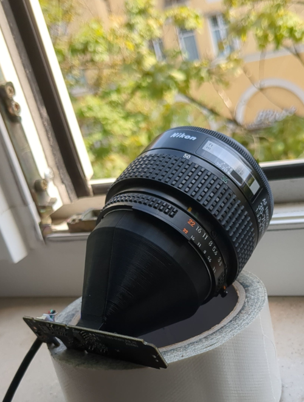

# Webcam camera lens adapter

Ever wanted to mount your camera lenses to a webcam?
Now you can.

This abomination is designed for *Nikon F*,
but the codes is designed for the flange to be easily replaceable.
My design target for the webcam was the cheapest one on eBay,
but since many webcams share their lens mount, it should be rather trivial to adapt it.
Variables you will need to change for that:

* `screw_distance` distance between the two mounting screws
* `mount_base` size of the square base of the lenst that mounts to the pcb
* `mount_wall` its wall thickness
* `base_thickness` and its height
* `sensor_distance` the distance between flange and sensor
* `sensor_offset` sensor plane offset to the pcb level. They usually pertrude.

You will also have to specify the size of the infrared filter (in `module filter_mount`):

* `l` edge length of filter square
* `h` and its height
* `lip` lip offset to rest the filter on
* `lip_h` and its height
